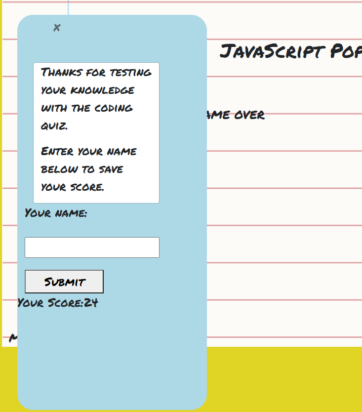

# JavaScrip Coding Quiz
### Welcome to LucSedirae's JavaScript quiz
 
In this application, the user is presented with a set of instructions and a start button. 
Once the start button is clicked, the instructions are replaced with a question and a series 
of possible answers. Click the corresponding answer button to submit your answer. 
 
A timer starts to count down from 50 once the quiz is started also. A correct answer 
will add 15 seconds of quiz time. A wrong answer will deduct 25 seconds. Your score 
at the end of the quiz will be equal to the remaining time on your timer. 
 
If you run out of time the quiz will score you based on the number of questions you did answer. 
If you receive a negative score, that means you should slow down, read the questions more 
cafefully and try again. 
 

 
Upon a game over scenario (either you ran out of time or finished all the questions) a modal 
will pop up alerting you that you have finished the quiz and letting you know your final score. 
You can also enter your name here and click submit to store your high scores so you can track 
your improvement with each instance of the quiz. 

 

